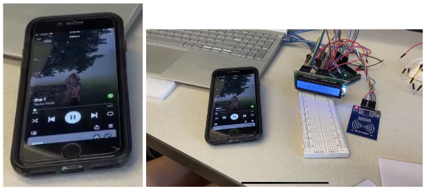

## Spotify Musicial Chairs

## Introduction
This project incorporates the Spotify API of which communicates with an arduino device. The sensor device we used for the arduino
device is an RFID sensor which scans RFID cards for spotify information. Each card is assigned
a track ID from spotify and once scanned, plays that song on an external device such as a phone,
or web application. We used an LCD display to show what song is on the card as well as who
wrote it. The arduino device communicated via usb with a python program that used the spotify
API to make calls for songs.

## Methods and Techniques
We assigned track ID numbers, of which are formatted and encrypted using Base62 and has a 22 character limit, We
created a python script of which that uses the Spotify API and communicates with the arduino
device via USB port. The arduino would scan an RFID card using the RFID scanner and then
send the spotify ID that is assigned to the card to the python script. The Python script would then
return the song information to the arduino device for displaying purposes on the LCD screen.

## Experimental Results
The python script we incorporated to establish connection between the Spotify API
and the arduino device worked as expected and communicated the RFID card information to 
the Spotify API of which the API would return the song name assigned to the RFID card number as
well as the artist who wrote that song. The python script worked spectacularly and did its job of
communicating spotify information to the arduino device via USB. For communication, we used
the package, “spotipy”, to ease the communication process of the Spotify API. An OAuth token
was needed to know which spotify account to interact with which we managed to grab through
the API’s OAuth system.

The arduino device had the RFID scanner and would communicate the RFID information
to the python script of which incorporated the spotify API. The arduino device worked as
expected. Using the RTOS task creator, the RFID scanner successfully communicated the spotify
ID, assigned to the card that was scanned, to the spotify API via USB. The information received
from the python script is then displayed on the LCD screen. In addition, any active spotify device
will automatically play the song that has been assigned. This setup worked as expected with little
to no problems. We showcased this as our demo and worked as advertised as well as the tasks
assigned from Part B.

## Overall Performance Summary
Incorporating the arduino with the RFID sensor and
LCD screen with a Python working with Spotify API script worked as intended. The arduino
could scan the RFID cards and could send the spotify ID to the python script and the python
script would spit out the song information back to the arduino device. Worked as expected and
would display the song information on the LCD screen as well as playing the song onto any
spotify active devices that was associated with the spotify account.

## Discussion and Conclusions
Incorporating not only the embedded knowledge that we gained throughout the quarter,
but giving external knowledge from other courses and experience in Python and API
implementation. We went beyond what was asked of us and executed it flawlessly. The arduino
got to communicate with the python script easily and information passed through between one
another via USB, worked as intended. Not only that, but we managed to have the song play on an
external device that had Spotify active just through the RFID scan.

## License
**Copyright &copy; 2023 Jordan Fraser. All rights reserved.**